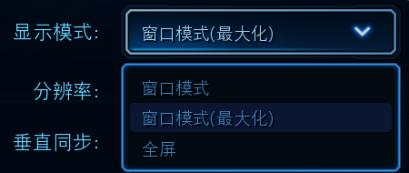
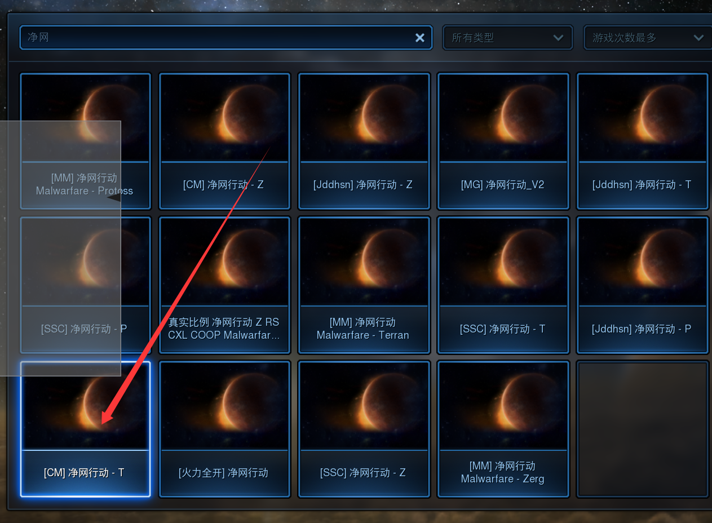
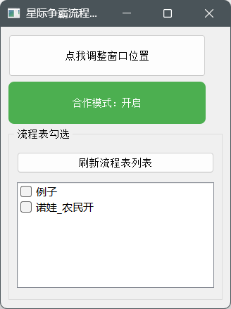
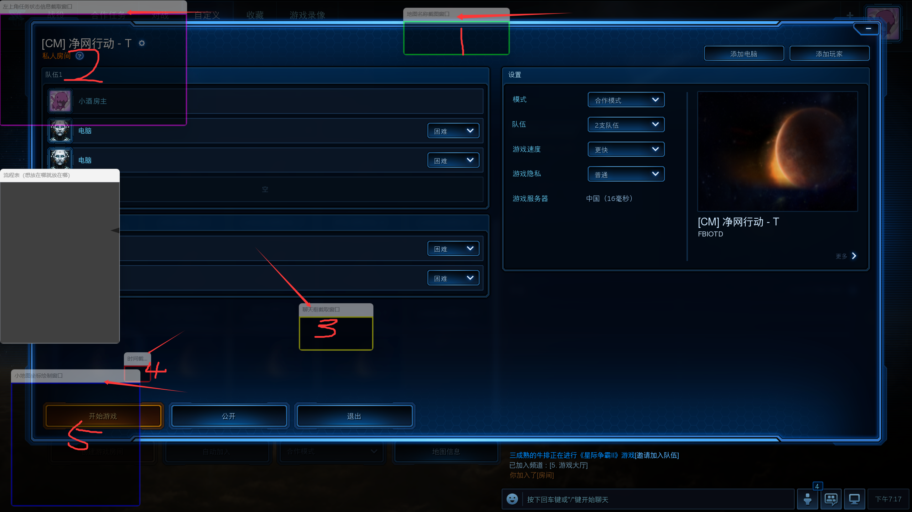
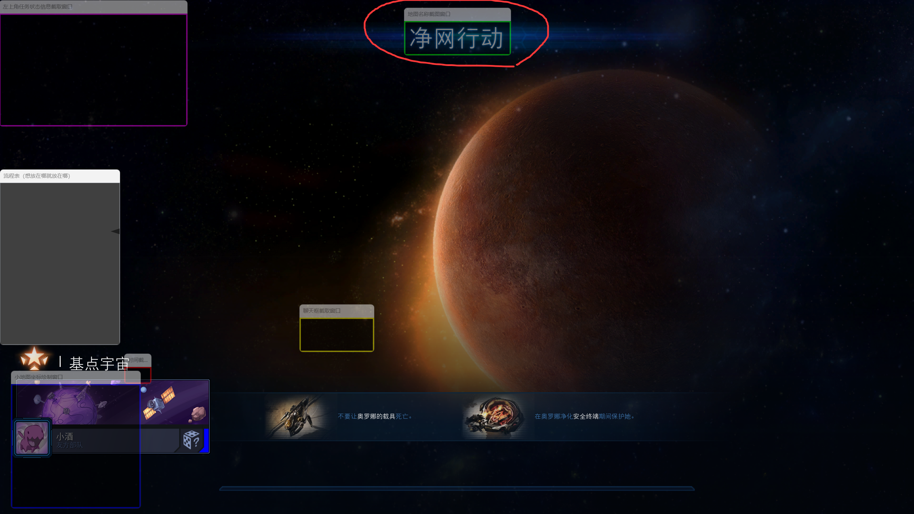
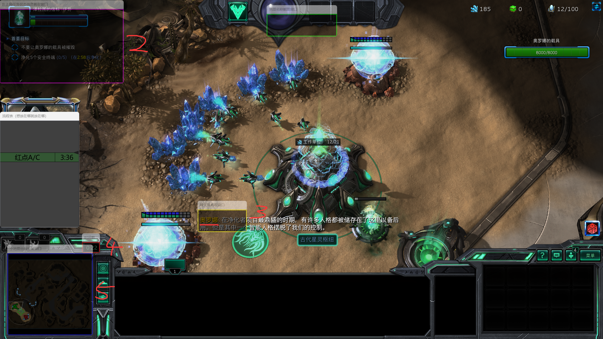
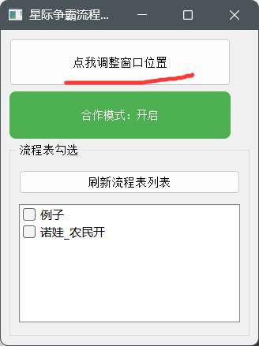

！！！由于该项目目前开发遇到困难（实际上是本人不懂得如何打包OCR依赖，如果有人懂怎么搞这些并且觉得可以提供帮助的话请联系我），因此暂不提供打包后的可执行程序。


如果你是一名开发者，可以自行创建安装了以下依赖的python环境：

```
pyqt5
pandas
pytorch-gpu
easyocr
opencv
```


安装完成后运行main.py文件即可


## 这个应用能做什么？

启动后，只需要第一次使用时设置好窗口位置，后续即可全自动识别地图名称、进入游戏内自动判断红点波型并在左侧窗口滚动播报红点时间（数据来自于NGA背板贴）、在小地图上绘制红点位置、当检测不到游戏内时间20秒后自动切换状态为不在游戏内等。


## 食用教程

初次使用可能需要进行一些配置，请按照以下流程走：


1. 首先请确保星际争霸2游戏设置中显示模式设置为窗口模式：
    
2. 在游戏大厅里搜索净网行动这张地图
    
3. 运行本程序后会出现主界面⬇

 

4. （第一次运行时可能需要调整适配，后续就不用了）点击按钮“点我调整窗口位置”，此时会发现屏幕上出现了多个窗口。
    

5. 接下来我们先调整**窗口1**的位置，它是地图名称的截取窗口，需要将其对准加载过程中的地图名称，如下：
    

6. 接下来选择泽拉图进入游戏（这里可以先调出主窗口点击一次“点我固定窗口位置”就能隐藏窗口）

7. 进入游戏后就可以调整剩下的窗口位置了。

    需要注意的点是：

    a. 左上角紫色的窗口需要将边框能够覆盖到“净化5个安全终端这一行字”

    b. 黄色边框的窗口任务是识别消息发送者的名称，所以保证覆盖到人名就行

    c. 左下角小一点的红色窗口是为了识别游戏时间，一定要精确覆盖

    d. 最左下角的蓝色窗口不仅是为了识别地图上的红点/压制塔等图标，也承担了绘制红点位置的任务，所以要让边框卡在小地图的窗口上

    

8.  等窗口设置完成后，再打开应用主界面，点击“点我固定窗口位置”就算设置成功了。
    